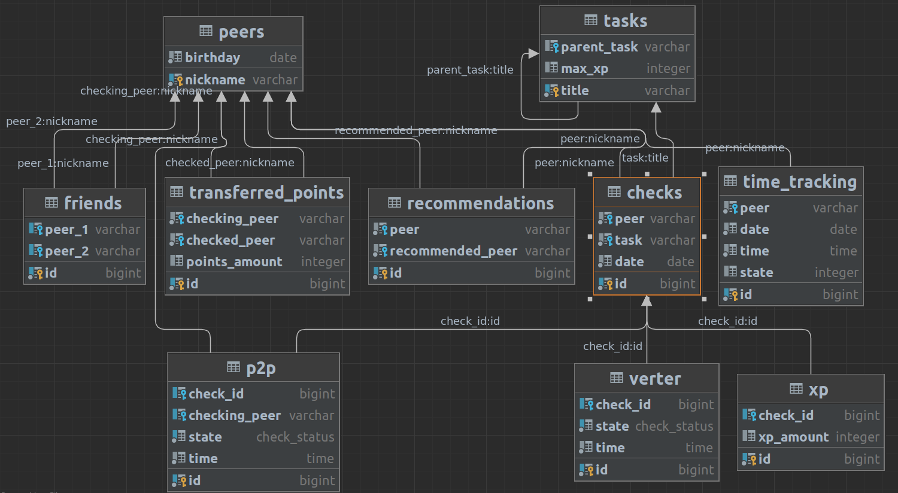

# InfoPostgreSQL

# Описание
Этот проект представляет собой систему управления и мониторинга активности пользователей в обучающей среде. Он разработан с целью облегчения взаимодействия между студентами и контролирующими органами, а также для повышения мотивации студентов выполнять задания и участвовать в активностях. 

# Таблицы

 
__Peers__
- Ник пира
- День рождения

__Tasks__

- Название задания
- Название задания, являющегося условием входа
- Максимальное количество XP

 Условия входа: Чтобы получить доступ к заданию, выполните задание, являющееся его условием входа.
 
__P2P__

- ID
- ID проверки
- Ник проверяющего пира
- Статус P2P проверки
- Время

Каждая P2P проверка состоит из двух записей: начало и успех/неуспех. В таблице не может быть больше одной незавершенной P2P проверки, относящейся к конкретному заданию, пиру и проверяющему.

__Verter__

- ID
- ID проверки
- Статус проверки Verter'ом
- Время

Каждая проверка Verter'ом состоит из двух записей: начало и успех/неуспех. Проверка Verter'ом может ссылаться только на те проверки в таблице Checks, которые уже включают в себя успешную P2P проверку.

__Checks__

- ID
- Ник пира
- Название задания
- Дата проверки

 Описывает проверку задания в целом. Проверка обязательно включает в себя один этап P2P и, возможно, этап Verter.

__TransferredPoints__

- ID
- Ник проверяющего пира
- Ник проверяемого пира
- Количество переданных пир поинтов за всё время (только от проверяемого к проверяющему).

При каждой P2P проверке проверяемый пир передаёт один пир поинт проверяющему.

__Friends__

- ID
- Ник первого пира
- Ник второго пира

Дружба взаимная, т.е. первый пир является другом второго, а второй -- другом первого.

__Recommendations__

- ID
- Ник пира
- Ник пира, к которому рекомендуют идти на проверку.

Каждый пир может рекомендовать как ни одного, так и сразу несколько проверяющих.

__XP__

- ID
- ID проверки
- Количество полученного XP
  
За каждую успешную проверку пир, выполнивший задание, получает какое-то количество XP.

__TimeTracking__

- ID
- Ник пира
- Дата
- Время
- Состояние (1 - пришел, 2 - вышел)
  
Данная таблица содержит информацию о посещениях пирами кампуса. Когда пир входит в кампус, в таблицу добавляется запись с состоянием 1, когда покидает - с состоянием 2.

# Часть 1. Создание базы данных

Скрипт __part1.sql__ создает базу данных и все необходимые таблицы в соответствии с требованиями проекта. Каждая таблица предназначена для хранения конкретных данных и информации о студентах, заданиях, проверках и других аспектах обучения и мониторинга. 
Добавлены процедуры для импорта и экспорта данных для каждой таблицы из файлов CSV, с возможностью указания разделителя CSV в качестве параметра. 
В каждую из таблиц было внесено как минимум по 5 записей для тестирования функциональности и проверки работы скрипта.

# Часть 2. Создание процедур добавления и триггеров

Скрипт __part2.sql__ включает в себя следующие функциональности:

- Процедура добавления P2P проверки, которая позволяет указать ник проверяемого, ник проверяющего, название задания, статус P2P проверки и время. В зависимости от статуса (начало или успешное окончание), добавляются записи в таблицы Checks и P2P.

- Процедура добавления проверки Verter'ом, которая позволяет указать ник проверяемого, название задания, статус проверки Verter'ом и время. Записи добавляются в таблицу Verter на основе самой поздней успешной P2P проверки.

- Триггеры, один из которых обновляет записи в таблице TransferredPoints после добавления записи со статусом "начало" в таблицу P2P, а другой проверяет корректность добавляемых записей в таблицу XP перед их добавлением.

# Часть 3. Создание процедур и функций для получения информации из базы данных

Скрипт __part3.sql__ содержит различные процедуры и функции для получения данных из базы данных. Эти процедуры могут быть использованы для анализа активности студентов, вычисления статистики и других операций, связанных с управлением и мониторингом активности в образовательной среде.

# Часть 4. Метаданные

В данной части задания создается отдельная база данных, в которой создаются таблицы, функции, процедуры и триггеры, необходимые для тестирования процедур. Эта часть задания позволяет работать с метаданными текущей базы данных и выполнять операции, связанные с удалением таблиц, поиском функций и уничтожением триггеров.

Хранимая процедура для удаления таблиц:

- Создана хранимая процедура, которая без уничтожения всей базы данных удаляет все таблицы, имена которых начинаются с определенной фразы 'TableName'. Это позволяет быстро и безопасно очищать базу данных от определенных таблиц, при этом сохраняя остальные данные.

Хранимая процедура для вывода списка скалярных SQL функций:

- Создана хранимая процедура с выходным параметром, которая выводит список имен и параметров всех скалярных SQL функций пользователя в текущей базе данных. Функции без параметров не выводятся. Имена функций и список параметров выводятся в одну строку. Выходной параметр возвращает количество найденных функций. Это удобно для анализа существующих функций в базе данных.

Хранимая процедура для уничтожения SQL DML триггеров:

- Создана хранимая процедура с выходным параметром, которая уничтожает все SQL DML триггеры в текущей базе данных. Выходной параметр возвращает количество удаленных триггеров. Это позволяет быстро очистить базу данных от триггеров, которые могут быть устаревшими или более не нужными.

Хранимая процедура для поиска объектов по тексту:

- Создана хранимая процедура с входным параметром, которая выводит имена и описания типа объектов (только хранимых процедур и скалярных функций), в тексте которых на языке SQL встречается строка, задаваемая параметром процедуры. Это позволяет быстро найти объекты в базе данных, содержащие определенный текст или ключевые слова.

Данная часть проекта предоставляет инструменты для работы с метаданными базы данных, что облегчает администрирование и анализ структуры и содержания базы данных.
 
 
 
В итоге, данный проект предоставляет базу данных и набор функциональностей для управления, мониторинга и анализа активности студентов в образовательной среде, что способствует более эффективному взаимодействию и мотивации студентов.
